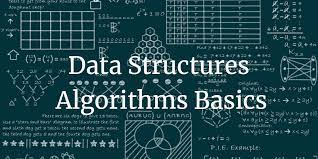

# ROUTE FINDER PROJECT:  FINAL EXAM OF ALGORITHMS AND DATA STRUCTURES

## Objectives:
+ Practical application of the techniques learned in the algorithms and data structures module of the Algorithms and Principles of Computer Science course.
+ Implementation of a solution to a problem by paying attention to concrete aspects of code efficiency.

For more information on the project, read the files in the 'project info' folder, which contain all the information you need to understand the specifications.

## Project testing
The project was tested using the .txt files in the scr\Open folder. 
The results are visible in the output.txt files.
